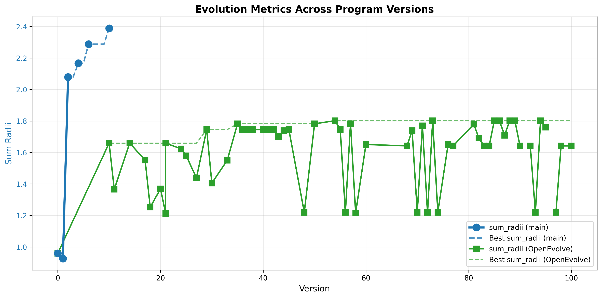
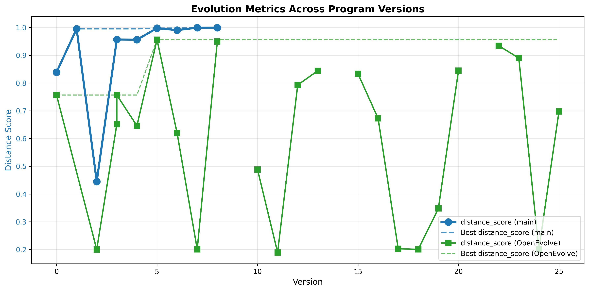

This is a "throwaway" repo created to play with [strands](https://github.com/strands-agents) and code evolution.

I set up code evolution as a two-agent swarm with researcher and supervisor agents. The researcher modifies and evaluates the code and reports its experience to the supervisor. The supervisor provides guidance without ever looking at the code. Such a setup has been used by other multi-agent systems, including recently, by [Glia](https://arxiv.org/pdf/2510.27176). 

## Running the code

The code currently runs model providers AWS Bedrock and Google Gemini (which should be easy to extend as strands supports many model providers). Pick your provider using the MODEL_PROVIDER environment variable. 

Run code using something like:

`MODEL_PROVIDER=bedrock AWS_PROFILE=<your-aws-profile-name> python code_evolution.py --initial-program examples/sorting_optimization/initial_program.py --evaluator examples/sorting_optimization/evaluator.py  --iterations 10`

For Gemini, `MODEL_PROVIDER=gemini GOOGLE_API_KEY=<your-google-api-key>`. You can specify the model using the MODEL_ID environment variable. The defaults are "us.anthropic.claude-sonnet-4-20250514-v1:0" for Bedrock and gemini-2.5-flash for Gemini. 

Ignore `opentelemetry.context - ERROR - Failed to detach context` errors on the console. This is an opentelemetry and strands swarms interaction. 

The command above will produce output in examples/sorting_optimization/evolution_output_{timestamp}

You can plot the results using

`python plot_evolution_metrics.py examples/sorting_optimization/evolution_output_20251218_205632/programs`

## Totally unscientific comparison with openevolve

Thanks to [openevolve](https://github.com/algorithmicsuperintelligence/openevolve), I could find examples to play with. Two such examples in this repo, examples/function_minimination and examples/circle_packing_with_artifacts, are from openevolve, with some minor changes to remove dependence of openevolve classes. 

As I could run the examples on both openevolve and my code, I though it'd be fun to compare. So I did a completely unscientific comparison. The two systems are using different prompts and models (Sonnet-4 vs an ensemble of Gemini-2.5-flash and Gemini-2.5-flash-lite). 

After cloning openevolve, I ran it with a command like the following: 

`OPENAI_API_KEY=<your-openai-compatible-key> python openevolve-run.py examples/circle_packing_with_artifacts/initial_program.py examples/circle_packing_with_artifacts/evaluator.py --config examples/circle_packing_with_artifacts/config_phase_1.yaml --iterations 100`

The OPENAI_API_KEY should be GOOGLE_API_KEY because openevolve will use the openai compatible endpoint that Google offers. The config file controls which models and providers are used. 

I then plotted a comparison with openevolve using:

`python plot_evolution_metrics.py examples/circle_packing_with_artifacts/evolution_output_20251218_150801/programs --openevolve examples/circle_packing_with_artifacts/openevolve_output/checkpoints/checkpoint_100/programs --metric1 sum_radii`

The result looked this like:

"Main" refers to this repo. Code evolution didn't hit the maximum 100 iterations because it came close to the sum_radii target of 2.635. The agent decided that this was good enough.

The result for function_minimination, which I ran for 25 iteraions, was:

The missing datapoints correspond to iterations where a valid program wasn't produced. 
